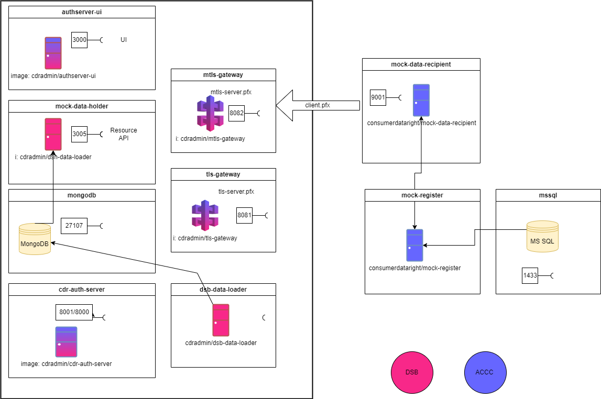

# DSB Test Data

This repository contains the source for

- data loader (load-test-data), which will load data from the `load-test-data\input` into a MongoDB, and 
- a data server (test-data-server), which exposes the API endpoints as documented in the DSB published technical standards.
- a set of docker files to create the containerised environment

*Note: Currently only the Energy API and the Common API endpoints have been implemented*

## Disclaimer

The artefacts in this repo are offered without warranty or liability, in accordance with the [MIT licence.](https://github.com/ConsumerDataStandardsAustralia/java-artefacts/blob/master/LICENSE)

[The Data Standards Body](https://www.csiro.au/en/News/News-releases/2018/Data61-appointed-to-Data-Standards-Body-role)
(DSB) develops these artefacts in the course of its work, in order to perform quality assurance on the Australian Consumer Data Right Standards (Data Standards).

The DSB makes this repo, and its artefacts, public [on a non-commercial basis](https://github.com/ConsumerDataStandardsAustralia/java-artefacts/blob/master/LICENSE)
in the interest of supporting the participants in the CDR eco-system.

The resources of the DSB are primarily directed towards assisting the [Data Standards Chair](https://consumerdatastandards.gov.au/about/)
for [developing the Data Standards](https://github.com/ConsumerDataStandardsAustralia/standards).

Consequently, the development work provided on the artefacts in this repo is on a best-effort basis,
and the DSB acknowledges the use of these tools alone is not sufficient for, nor should they be relied upon
with respect to [accreditation](https://www.accc.gov.au/focus-areas/consumer-data-right-cdr-0/cdr-draft-accreditation-guidelines),

# Overview

This repository provides a convenient way to create a test data server. The system consist of a number of docker containers, some of which are maintained by the ACCC, others are maintained by the Data Standards Body.

## How to use

This instructions are if you want to run this system in a containerised environment.

**Run `docker compose up`**

By default this will pull the images from the consumerdatastandardsaustralia Dockerhub.
As a result the system will host the data as contained in the `load-test-data\input\<VERSION>` directory.

If the image for the mssql container is rebuild, then additional set instructions as outlined below must be completed. 

Wait until all containers have started and are *healthy*, then follow the *Additional Setup Steps* below where this applies.

### Additional Setup Steps

Some manual setup steps need to be completed for the system to function. 

1. Initialisation script (essential)

   The current setup bypasses the client registration, i.e. it the "accredited data recipient" is created via the backdoor using an SQL script.
   This step is essential for the functioning of the `mock-data-recpient` and the authorisation process.
   In order to complete this step, you a need to connect to the SQL database used by the mock-register.
   
   The conenction detail (i.e. username/ passowrd) can be found in the `docker-compose.yaml` for the `mssql` container.
   
   *Default is user=sa, pwd=Pa{}w0rd2019*

   - connect to the the SQL instance running
   - run the script in `utils\sql\\AddClientScriptRelease.sql`

   This will create a registered client.

2. Edit Host file  (essential)
   
   A number of entries are required in the `host` file. These entries typically are in *C:\Windows\System32\drivers\etc\hosts* on Windows platforms, and */private/etc/hosts* on MacOS (although this may be different).

   - 127.0.0.1 mock-data-holder
   - 127.0.0.1 mock-data-recipient
   - 127.0.0.1 mock-data-holder-energy
   - 127.0.0.1 mock-register
   - 127.0.0.1 mtls-gateway
   - 127.0.0.1 tls-gateway

These entries match the names of the containers and are required to resolve host names.

3. App config settings (depends)
   
   The `config` folder contains a number of appsettings files, which are utilised during the docker build process.
   Normally you would leave these files as they are unless you start changing urls, ids, etc.

   At time there may be a need to edit some values. For instance, the default validity period for an access token can be set in the `auth-server\appsettings.Release.json`.

   If any setting is changed, the containers need to be rebuild.
   Ie, `docker compose down`, followed by `docker compose up --build`.
   
   Step 1 may need to be repeated.

4. Certificates (depends)
   
   The certificates being used by the containers have been created for this setup. In particular, the naming of hosts is important when certificates are created. So, unless you change stuff in that space or you want to use your own CA, there should be nothing that requires change her.

   If any setting is changed, the containers need to be rebuild.
   Ie, `docker compose down`, followed by `docker compose up --build`.
   
   Step 1 may need to be repeated.

## Accessing the resource API

To acces the resource API you need
- generate an access token
- call the resource API with a client certificate

### Generate an access token

In order to obtain an access token, the PAR authorisation flow must be completed using the mock-data-recipient. The ACCC [documentation](https://github.com/ConsumerDataRight/mock-data-recipient) on the mock-data-recipient contains more detailed information.

Navigate to `https://mock-data-recipient:9001` and complete the authentication flow.

Required for authorisation flow is a LoginID. The resource dataset will contain all the user loaded by the `dsb-data-loader` container. Refer to the data files in the `load-test-data\input` directory to obtain a LoginID (LastName.FirstName). 
*Note:You could also use a UI to the actual data, such as MongoDB Compass to read this directly*

### Call the resource API

To access the resource API you can utilise the swagger UI provided by mock-data-recipient container, or alternatively retrieve the access token from the mock-data-recipient UI and use as required.  The authenticated resource endpoints accessed via the mtls-gateway (`https://mtls-gateway:8082`), the unauthenticated ones via the tls-gateway (`https://tls-gateway:8081`).

When using the mock-data-recipient UI the client certificate is automatically presented when the data holder API is beign called.

If another UI is used to call the data holder via the mtls-gateway the `mtls-gateway\client.pfx` for any calls to authenticated endpoints is required.

## Use Postman to interrogate the data holder resource API

If you want to use Postman, the `mtls-gateway\client.pfx` certificate must be associated with `https://mtls-gateway:8082` and the `mtls-gateway\ca.pem` must be specified as the Certificate Authority. Please refer to the Post certificate management documentation for more information.

The running test data server can then be interrogated using the `CDR_Energy_Sector_Conformance_tests` collection
from the [Postman collection](https://github.com/ConsumerDataStandardsAustralia/dsb-postman) repository.

The Postman environment file `DSB Test Data Server - Authenticated.postman_environment.json` in the `test-data-server\postman` folder within *this* repo will set identifiers for accounts, service points, and plans for a customer for the datasets found in the `input\1.24.0` in this repo.

